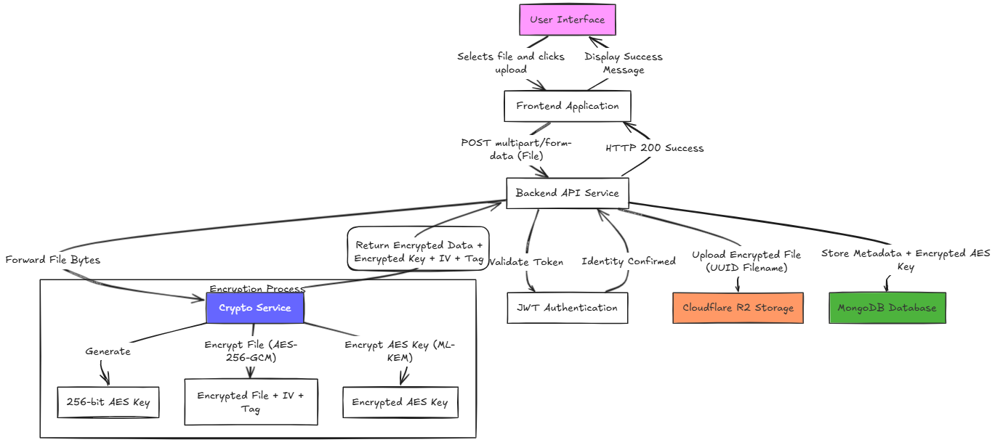

# PQC Cloud Storage

A post-quantum cryptography based secure cloud storage system built as a final year group project. Every file uploaded to this system is encrypted before it ever reaches the cloud, and the encryption is designed to remain secure even against future quantum computers.

---

## The Problem

Current cloud storage platforms like Google Drive and Dropbox store files in a way that the platform itself can access them. Even when encryption is used, it typically relies on algorithms like RSA and ECC which are mathematically breakable by quantum computers using an algorithm called Shor's algorithm.

Quantum computers capable of breaking RSA do not exist yet, but the threat is real and active today through a strategy called "harvest now, decrypt later." Attackers collect and store encrypted data today, wait for quantum computers to mature, then decrypt everything retroactively. For sensitive data that needs to remain confidential for years, this is a genuine threat.

NIST, the US standards body, officially standardized the first post-quantum cryptographic algorithms in 2024. Our project implements one of those standards.

---

## What We Are Building

A cloud storage platform where:

- Files are encrypted on the server before being stored anywhere
- The encryption keys themselves are protected using a quantum-resistant algorithm
- The cloud storage provider only ever receives unreadable encrypted blobs
- Even if the database and cloud storage were both breached simultaneously, an attacker would have encrypted files and encrypted keys with no way to connect or use them
- Files can optionally self-destruct after a set time or number of downloads

This is not a theoretical exercise. Every component uses real cryptographic implementations on real infrastructure.

---

## Why This Matters Now

NIST finalized ML-KEM (formerly known as CRYSTALS-Kyber) as a post-quantum key encapsulation standard in 2024. Google, Cloudflare, and several governments have already begun migrating their systems. This project demonstrates a practical implementation of that standard in a full stack application, which is directly relevant to where the industry is heading.

---

## How the Encryption Works

The system uses hybrid encryption, which combines two algorithms — one fast, one quantum-resistant.

### AES-256-GCM

AES (Advanced Encryption Standard) is used to encrypt the actual file. It is fast, battle-tested, and handles large data efficiently. AES-256 uses a 256-bit key, which even quantum computers cannot brute force in any practical timeframe. Grover's algorithm, the best known quantum attack on symmetric encryption, only halves the effective key length to 128 bits, which remains secure.

GCM (Galois Counter Mode) is the mode of operation. It provides both encryption and authentication, meaning any tampering with the encrypted file is detectable.

### ML-KEM (CRYSTALS-Kyber)

ML-KEM is used to encrypt the AES key itself. This is the quantum-resistant layer. It is based on the hardness of the Module Learning With Errors (MLWE) problem, which has no known efficient quantum algorithm to solve it.

ML-KEM is not used to encrypt the file directly because it is designed for small data like keys, not large files. AES handles the heavy lifting. ML-KEM protects the key that unlocks the heavy lifting.

### Why Hybrid

Using ML-KEM alone would be too slow for large files. Using AES alone would leave the key vulnerable to quantum attacks. Hybrid encryption uses each algorithm for exactly what it is good at.

```
File + random AES key → AES-256-GCM → encrypted file (stored in R2)
AES key + ML-KEM      → ML-KEM       → encrypted AES key (stored in MongoDB)
```

An attacker who steals the encrypted file from R2 has nothing without the AES key.
An attacker who steals the encrypted AES key from MongoDB has nothing without ML-KEM decapsulation.
An attacker who steals both still cannot decrypt without the ML-KEM private key, which never leaves the crypto service.

---

## Architecture

The system is divided into three independent services that communicate over HTTP.

### Frontend — Next.js

Handles everything the user sees and interacts with. The dashboard for managing files, the upload interface, the download button, authentication pages. It communicates exclusively with the backend through REST API calls. It has no direct knowledge of encryption, cloud storage, or the database. It is a pure interface layer.

### Backend — Node.js / Express

The central coordinator of the system. It handles user authentication using JWT, receives uploaded files from the frontend, orchestrates the encryption pipeline by communicating with the crypto service, stores encrypted files in Cloudflare R2, saves metadata and encrypted keys in MongoDB, and reverses the entire process on download. All business logic lives here.

### Crypto Service — Python / FastAPI

A small, isolated microservice with one responsibility: encryption and decryption. It receives raw file bytes, returns encrypted bytes and an encrypted key on upload. It receives encrypted bytes and an encrypted key, returns plain bytes on download. It knows nothing about users, databases, or cloud storage.

The reason this is a separate service rather than code inside the backend is isolation. Cryptographic code is sensitive. Keeping it isolated means it can be audited independently, upgraded without touching the rest of the system, and replaced when ML-KEM implementations mature. In Phase 1 this service uses a mock key wrapping implementation. In Phase 3 it is replaced with the real liboqs ML-KEM implementation without changing anything else.

### MongoDB

Stores everything except the actual file content. User accounts with hashed passwords, file metadata including the original filename and upload date, the encrypted AES key, the R2 storage reference, self-destruct settings, download counts, and activity logs. The encrypted AES key is safe to store here because it is protected by ML-KEM. Without the crypto service it is useless.

### Cloudflare R2

Stores the encrypted file blobs and nothing else. R2 is private by default — files have no public URL. The only way to access a file is through the backend, which generates a presigned URL that expires in 60 seconds. The URL stored in MongoDB is never exposed to the frontend or the user. Even if someone obtained both the MongoDB record and the R2 file, they would have an encrypted key and an encrypted file with no way to use either.

---

## Data Flow

### Upload



### Download

```
User requests a file
    → Frontend sends download request to backend
    → Backend authenticates request via JWT
    → Backend checks MongoDB — does this user own this file?
    → Backend fetches encrypted file from R2
    → Backend fetches encrypted AES key from MongoDB
    → Backend sends both to crypto service
    → Crypto service decrypts AES key using ML-KEM
    → Crypto service decrypts file using AES key
    → Crypto service returns plain file bytes
    → Backend streams plain file to user
    → Backend increments download count, checks download limit
    → If limit reached, file is deleted
```

---

## Database Design

### Users Collection

Stores account information. Passwords are hashed using bcrypt before storage. The plaintext password never touches the database.

### Files Collection

Stores everything about a file except the file itself. The cloudUrl field points to the R2 location. The encryptedAESKey field stores the ML-KEM protected key. The expiresAt and downloadLimit fields drive the self-destruct feature.

### Logs Collection

Stores a record of every action — upload, download, delete — with a timestamp and the user who performed it. Used for the activity log feature in the dashboard.

---

## Security Principles

Every design decision in this project follows from these principles:

The cloud storage provider never has access to plaintext files. Encryption happens before upload, decryption happens after download, and the keys never reach R2.

Keys are never stored in plaintext. AES keys are encrypted with ML-KEM before being saved to MongoDB.

The crypto service is internal only. It is never exposed to the internet, only reachable from the backend within the same network.

Files in R2 have no public URLs. All access is mediated by the backend using short-lived presigned URLs.

Filenames in R2 are random UUIDs. The original filename is only in MongoDB, associated with the authenticated user.

---

## Development Status

This project is in initial setup. The repository structure, environment configuration, and dependency installation are complete. Active development begins with the backend authentication system.

| Phase | Scope | Status |
|-------|-------|--------|
| Phase 1 | Auth, basic file upload, dashboard | In progress |
| Phase 2 | AES encryption, Python microservice integration | Pending |
| Phase 3 | ML-KEM integration, download and decryption | Pending |
| Phase 4 | Self-destruct, activity logs, search, Docker | Pending |

---

## License

This project is built for academic purposes as a final year project.